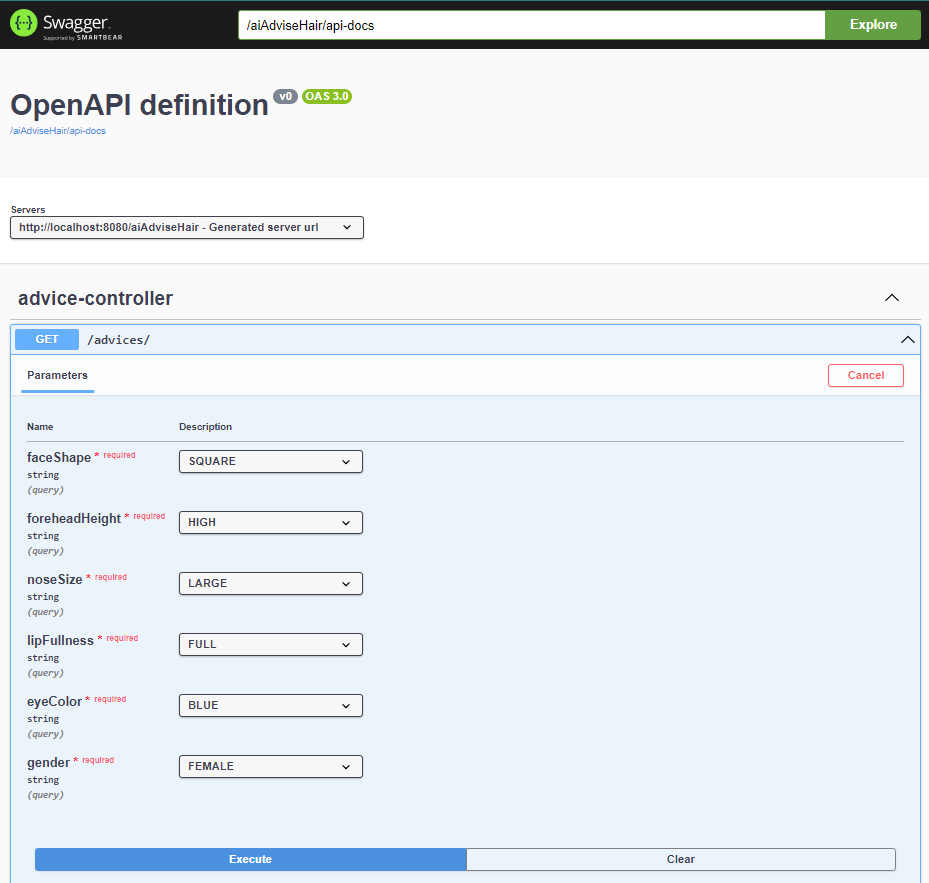
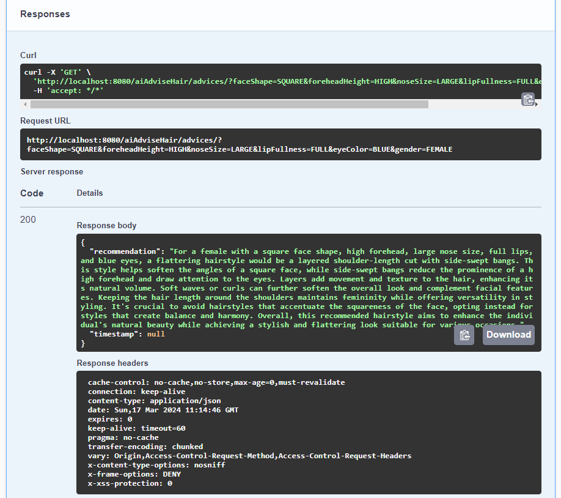

## The application is currently available only through Swagger deployed on Azure.
[Ai advise hair](https://aihairadvise.happyflower-f25c91cc.eastus2.azurecontainerapps.io/aiAdviseHair/swagger-ui/index.html)

## Warning! Work in progress! :)

## Todo:

Features still needed to be done:

~~1. **Swagger Documentation**: Add swagger endpoints.~~

~~2. **Database**: Create and host database somewhere.~~

~~3. **Database**: Fill database with advices.~~

~~4. **Database**: Fill database with recommendations.~~

~~5. **Backend**: Deploy backend to Azure Cloud.~~

6. **Backend**: Add timestamp to Advice model.

7. **Database**: Add timestamp to Advice entity.
   
8. **Tests**: Add tests.

9. **Ai**: Generate hairstyle image based on recommendation.

10. **Backend**: Add image to Advice Model.

11. **Database**: Add images to database.

12. **Frontend**: Create simple frontend.

13. **CI/CD**: Create GitHub Action pipeline.


# AI Hair Advise API

Welcome to the AI Hair Advise API! This RESTful API provides a convenient way to generate recommended hairstyles based on human characteristics. Whether you're an individual looking for a fresh style or a hairdresser seeking suggestions for your clients, this application has you covered.

Please use the application carefully and patiently. The resources are hosted on free or almost free tiers, which may result in slower network performance. Be mindful of the allocated resources to ensure optimal usage within the constraints of the chosen pricing plans. Excessive usage may result in the unavailability of the service.


## Technologies Used

- **Java 17**: The core programming language used to build the application.
- **Azure Deployment**: The application is hosted on the Azure cloud platform, ensuring reliability and scalability.
- **PostgreSQL Database**: Human characteristics data is stored securely on ElephantSQL, a PostgreSQL database service.
- **Spring 3**: The backend is built using the Spring framework, providing a robust and flexible architecture.
- **Swagger**: API documentation is powered by Swagger, making it easy for developers to explore and understand the available endpoints.

## How It Works

The API takes human characteristics as input and leverages the power of AI through ChatGPT 3.5 Turbo to recommend suitable hairstyles. It generates personalized responses based on the provided characteristics while utilizing the knowledge of AI to suggest trendy and fitting hairstyles.

## Getting Started

To use the API, follow these steps:

1. **Swagger Documentation**: Explore the API using the Swagger documentation available at [API Documentation](https://aihairadvise.happyflower-f25c91cc.eastus2.azurecontainerapps.io/aiAdviseHair/swagger-ui/index.html).

2. **Make Requests**: Use Swagger UI or any API testing tool to make requests to the API, providing human characteristics as input. Below example request:
 

3. **Get Recommendations**: Receive personalized hairstyle recommendations based on the input characteristics, generated with the help of AI ChatGPT 3.5 Turbo.


## Example request

```json
{
  "faceShape": "SQUARE",
  "foreheadHeight": "HIGH",
  "noseSize": "LARGE",
  "lipFullness": "FULL",
  "eyeColor": "BLUE",
  "gender": "FEMALE"
}
```

## Example response

```json
{
  "recommendation": "For a female with a square face shape, high forehead, large nose size, full lips, and blue eyes, a flattering hairstyle would be a layered shoulder-length cut with side-swept bangs. This style helps soften the angles of a square face, while side-swept bangs reduce the prominence of a high forehead and draw attention to the eyes. Layers add movement and texture to the hair, enhancing its natural volume. Soft waves or curls can further soften the overall look and complement facial features. Keeping the hair length around the shoulders maintains femininity while offering versatility in styling. It's crucial to avoid hairstyles that accentuate the squareness of the face, opting instead for styles that create balance and harmony. Overall, this recommended hairstyle aims to enhance the individual's natural beauty while achieving a stylish and flattering look suitable for various occasions.",
  "timestamp": null
}
```

NOTE: timestamp not added yet. So, null value for 'timestamp' field is expected.

## Swagger Documentation

Explore and interact with the API using the Swagger documentation available at Swagger UI.

## Release notes

No release currently available

## Note

This is the backend and API version for now. Future versions may include a frontend for a more user-friendly experience.

Feel free to reach out if you have any questions or feedback. Happy hairstyling!

